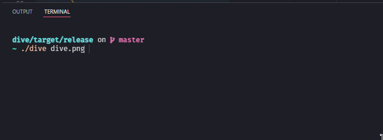

# Dive

🔎 Search millions of files at lightning-fast speeds to find what you are looking for!

### [Download](https://github.com/ffaanngg/dive/releases/download/Stable/dive.exe)

## Dive in action!

## Reference

The CLI takes in 2 arguments, the first being the `regex` expression for matching the filename and the second being the directory to search in. If the directory is not mentioned, the root directory of your system is chosen and all the files in your system are searched.
 
If there are any permission errors while searching, they are simply ignored.

